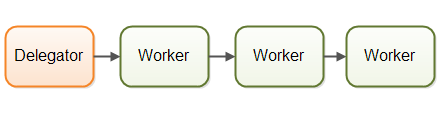
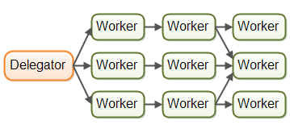

# はじめに

本記事ではJavaにおける並列処理を主に個人の備忘録、勉強用として雑に記しています。

# 並列処理

並列処理とは複数のスレッドを使って、メインスレッドとは別のスレッドでプロセスを行うことである。

## 並列処理における問題例

スレッドAがメモリを読み込んでいる間にスレッドBがそのメモリに書き込みをしたら、スレッドAで読み取られるのは新しい値か古い値か？

## なぜマルチスレッドプログラミングではなく並列処理なのか

マルチスレッドプログラミングや分散コンピューティングで起きる問題は並列処理と似ているのでここでは並列処理を使います。

# なぜ並列処理するのか

- リソース利用の最適化
    - CPUのアイドルタイムを減らす
- プログラムの高速化
    - 例えばサーバーからリクエストをlistenしてそのリクエストを処理するループがあるとする。
    ```java
      while(server is active){
        // リクエストを受ける
        ...
        // リクエストを処理する
    }
    ```
    このループではリクエストを処理してる間は他のリクエストを受けれなくなってる。もしリクエストの処理のタスクを他のスレッドに受け渡せば、すぐにまたリクエストを受けれるようになる。
    ```java
      while(server is active){
        // リクエストを受ける
        ...
        // リクエストを他スレッドに受け渡す
    }
    ```

# 主な並列処理モデル

ここで紹介する並列処理モデルは分散コンピューティングシステムに使われるモデルと共通するのもあります。

## Parallel Workers

 

出典: [Jenkov.com](http://tutorials.jenkov.com/java-concurrency/concurrency-models.html#concurrency-models-and-distributed-system-similarities)

Delegatorがworkerにタスクを分散する方法です。Parallel worker モデルは最もJavaの並列処理に使われているモデルです。`java.util.concurrent`パッケージに含まれているツールはこのモデルに基づいて作られています。

### 利点/欠点

- 利点
    - 簡単
- 欠点
    - 複数のworkerが同じメモリもしくはデータベースを改変している場合、workerスレッドはその改変が他のworkerスレッドにも知らされるようにならなければいけません。(CPUの実行に留まらず、メモリにプッシュされなければならない)
    - [競合状態](#競合状態とクリティカルセクション)やデッドロックといった並列処理におけるよくある問題を避けなければならない。
    -スレッドが同じデータ構造へのアクセスを待ってしまうと並行化(parallelisation)が失われてしまう。
    - タスクの順番が決定的ではない。これにより、現在のシステムのステートがどうなっているのか分からなくなる場合がある。

## Assembly Line



出典: [Jenkov.com](http://tutorials.jenkov.com/java-concurrency/concurrency-models.html#concurrency-models-and-distributed-system-similarities)

Workerにタスクの役割があって、一つのタスクが終わると次のWorkerにタスクが移行する。



出典: [Jenkov.com](http://tutorials.jenkov.com/java-concurrency/concurrency-models.html#concurrency-models-and-distributed-system-similarities)

こんなことになることも。

### 利点/欠点

- 利点
    - 共有ステートがない
    - タスクに順番がある
- 欠点

## Same-threading

シングルスレッドのプログラムを複数のCPUコアを活用するために複数コアに渡ってスケールすること。このモデルでは共有されるデータ構造、メモリはありません。

# 並列(concurrency) vs 並行(parallelism)

並列化と並行化という単語は同じマルチスレッドプログラミングにおいてよく使われますが、同一ではありません。

## 並列化

システムが複数のタスクを一度にこなすこと。

## 並行化

タスクがサブタスクに分散して一度に複数のサブタスクをこなすこと。

# Javaでスレッドを作る

Javaではスレッドはオブジェクトとして扱われています。

```java
public class StartThread {

    public static void main(String[] args) {
        Thread myThread = new Thread();
        myThread.start();
    } 
}
```

`myThread.start();`でスレッドを始めています。しかしこれではスレッドは何もしていません。

## `run`メソッドをオーバーライドしてスレッドでコードを動かす

スレッドに動くコードを指定するには`Thread`のサブクラスを作り、`run`メソッドをオーバーライドします。

```java
public class StartThread {

    public static class MyThread extends Thread {
        @Override
        public void run() {
            System.out.println("Hello World");
        }
    }

    public static void main(String[] args) {
        Thread myThread = new MyThread();

        myThread.start();
    }

}
```

## `Runnable`インターフェースでスレッドを実装

`Runnable`をコンストラクタとして通してスレッドを作ることができます。

```java
public class StartThread {

    public static class MyRunnable implements Runnable {
        @Override
        public void run() {
            System.out.println("Hello again");
        }
    }

    public static void main(String[] args) {
        Thread myThread1 = new Thread(new MyRunnable());

        myThread1.start();
    }

}
```

# 競合状態とクリティカルセクション

競合状態はクリティカルセクションで起こりうる状態です。

## クリティカルセクション

クリティカルセクションとはコードが複数のスレッドで実行されて、その順番によって結果が異なる状態です。複数のスレッドが同じクリティカルセクションに書き込みしようとすると問題が発生します。

```java
  public class Counter {

     protected long count = 0;

     public void add(long value){
         this.count = this.count + value;
     }
  }
```

上記のクラスでは`add`メソッドがクリティカルセクションになります。

## 競合状態

上のクリティカルセクションを2つのスレッドAとBで実行されます。まずスレッドAとBがレジスターに`this.count = 0`を読み込みます。まずスレッドAが読み込まれた`this.count`に2を足します。その後、スレッドBが読み込まれた`this.count`に3を足します。この場合、最終的な結果は`this.count = 5`ではなく、`this.count = 3`になります。

上記のように複数のスレッドが同じリソースを取り合うことを競合状態といいます。

## 競合状態を防ぐ

競合状態を防ぐにはクリティカルセクションを不可分操作(atomic)状態にします。つまり、一つのスレッドが実行中には他のスレッドが実行できない状態にします。

これを実現するにはクリティカルセクションでスレッド同期を行います。スレッド同期を行うこと以外ではスレッドロックや`java.util.concurrent.atomic.AtomicInteger`などの不可分操作変数を使うことができます。

# スレッドセーフと共有リソース

複数のスレッドに同時で実行されても安全なコードをスレッドセーフと呼びます。スレッドセーフなコードは競合状態を起こしません。競合状態は複数のスレッドが共有リソースをアクセスすることで起こります、なのでどういったリソースが共有なのかを知ることが大切です。

## ローカル変数

ローカル変数はスレッドのスタックに保存されるのでスレッド間で共有されることがありません。プリミティブ型のローカル変数は常にスレッドセーフです。

## ローカルオブジェクト参照

この場合は、参照自体は共有されません。しかしオブジェクトは共有ヒープに保存されます。もしオブジェクトがローカルで作成されメソッドの外には出ない場合、スレッドセーフです。

## メンバ変数

メンバ変数はオブジェクトと共にヒープに保存されています。スレッドセーフではありません。

# `synchronized`キーワード

Javaの同期ブロックはすべて`synchronized`で